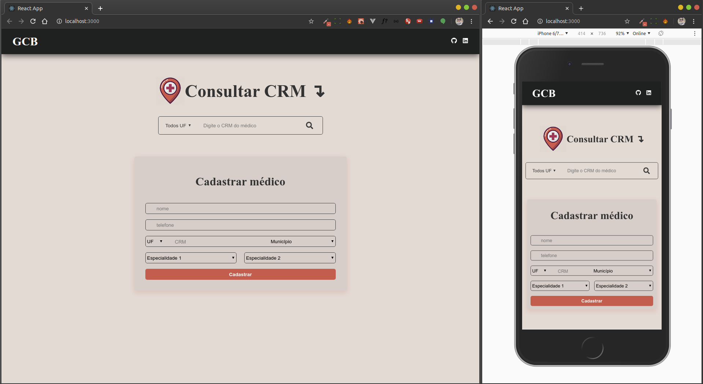

<h1 align="center">
 
  
 
 
TEST-BACKEND-GCB
</h1>

Project test for job backend in GCB-Investimentos

  

## Features

[//]: # "Add the features of your project here:"

- ⚛️ **React Js** — A JavaScript library for building user interfaces
- 💹 **Node Js** — A web framework for Node Js

## Getting started

- Into the folder backend have a file _doctors.sql_ to create data base on MySql.

- run `yarn dev` or `npm run dev` in folder backend.

- run `yarn start` or `npm start` in folder frontend.

## License

This project is licensed under the MIT License - see the [LICENSE](https://opensource.org/licenses/MIT) page for details.
